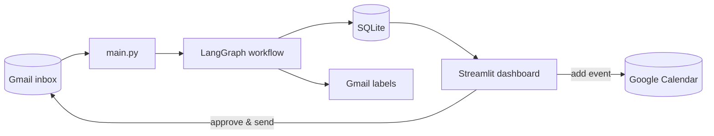
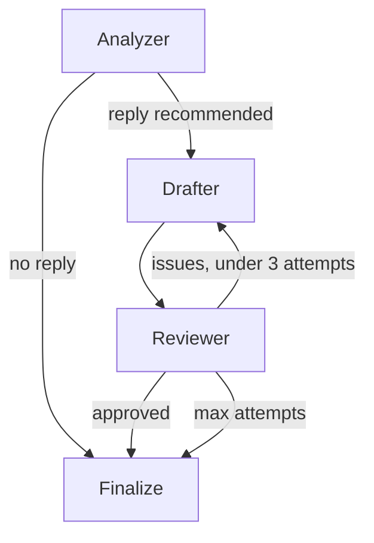

# Email Assistant

Personal Gmail assistant that triages inbox mail with a multi-agent AI pipeline, extracts events and deadlines, drafts replies, and syncs results to Gmail labels and Google Calendar — with human approval before anything is sent.

## Demo
https://drive.google.com/file/d/1y-0OImTnn3uOss1CrPhdiGEgaAU_GK6g/view?usp=sharing

## Tech Stack

| Layer | Tools |
|-------|-------|
| **Language** | Python 3.12+ |
| **LLM** | Google Gemini (`gemini-2.5-flash`) via LangChain |
| **Orchestration** | LangGraph — multi-agent state machine with conditional routing and revision loops |
| **Frontend** | Streamlit |
| **APIs** | Gmail API (read, label, send), Google Calendar API (event creation) |
| **Auth** | Google OAuth 2.0 (single token for Gmail + Calendar) |
| **Database** | SQLite |
| **Config** | python-dotenv, Pydantic |

## System Flow



**Processing pipeline**

1. User triggers a run from the dashboard or CLI (`app/main.py`)
2. Gmail client fetches recent primary inbox messages (read + unread), skips already-processed mail, sorts newest-first
3. Each message enters the LangGraph workflow (`app/workflow/graph.py`)
4. Results are persisted to SQLite and priority labels are applied in Gmail
5. User reviews the queue in Streamlit — edits drafts, sends replies, or adds extracted dates to Google Calendar

Processing is **on-demand** rather than scheduled, to keep LLM API usage bounded, but this can be deployed to be automatic.

## Multi-Agent Workflow

Three Gemini agents run as nodes in a LangGraph `StateGraph`, sharing state through `EmailWorkflowState`.



| Agent | Responsibility |
|-------|----------------|
| **Analyzer** | Classifies priority, summarizes, extracts action items, events, deadlines, and structured calendar entries; decides if a reply is needed |
| **Drafter** | Writes a reply draft using analysis context (and reviewer feedback on retries) |
| **Reviewer** | Validates the draft against the original email; sends issues back to the Drafter or approves |

When a reply is recommended, the pipeline makes **1–3+ Gemini calls** per email (analyze + draft + up to 3 review/revise loops). Replies and calendar entries always require explicit user action in the dashboard before sending or creating events.

## Priority Classification

The Analyzer agent classifies each email into one of four priorities — **High**, **Medium**, **Low**, or **Newsletter** — using prompt engineering rather than hardcoded rules alone.

The system prompt in `app/prompts/templates.py` instructs Gemini to return structured JSON and defines how to reason about attention level: what counts as urgent vs. informational, when a date implies a real obligation, and when marketing urgency is just promotional noise. Tie-breaking rules in the prompt handle edge cases (e.g. security alerts are always Medium, not High; promotional countdowns stay Low even with deadlines).

| Priority | Example emails |
|----------|----------------|
| **High** | Interview invite requiring a response, assignment due this week, failed payment blocking account access |
| **Medium** | New sign-in alert, friend asking to meet up, ticket confirmation for an event next month |
| **Low** | Order receipt, product sale email, optional campus event roundup |
| **Newsletter** | TLDR digest, Substack article, recurring news roundup |

Classified priorities are synced to Gmail as labels (`AI-High`, `AI-Medium`, etc.) and surfaced in the dashboard for filtering and review.

## Project Structure

```
app/
├── main.py              # Processing orchestrator
├── workflow/graph.py    # LangGraph multi-agent workflow
├── prompts/templates.py # Agent system prompts
├── llm/interface.py     # LLM abstraction
├── gmail/client.py      # Gmail API
├── calendar/            # Google Calendar integration
├── database/repository.py
└── dashboard/streamlit_app.py
```
